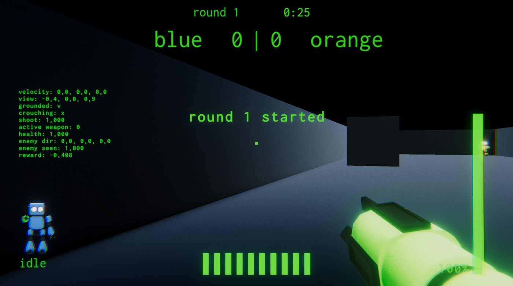
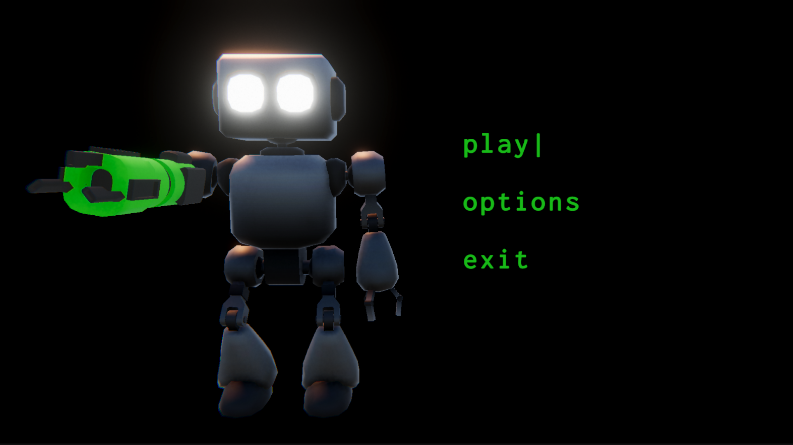
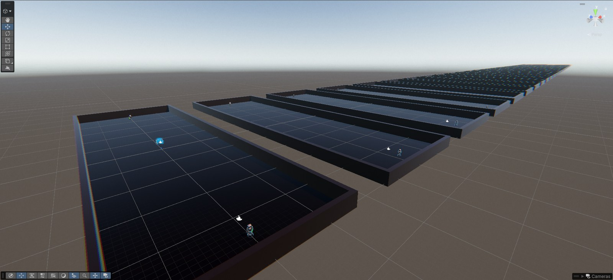
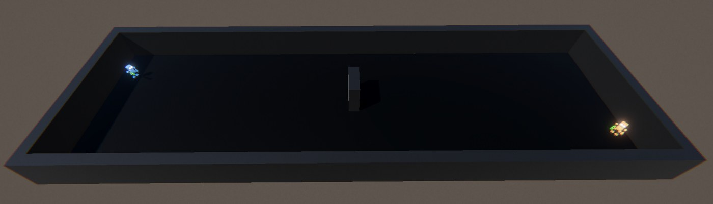
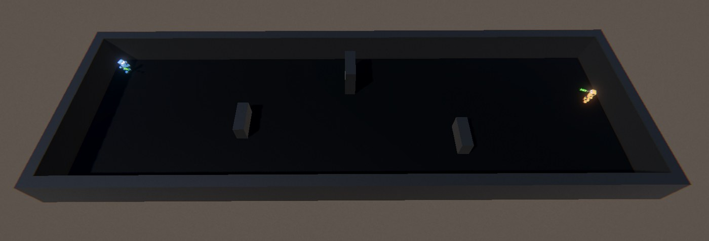
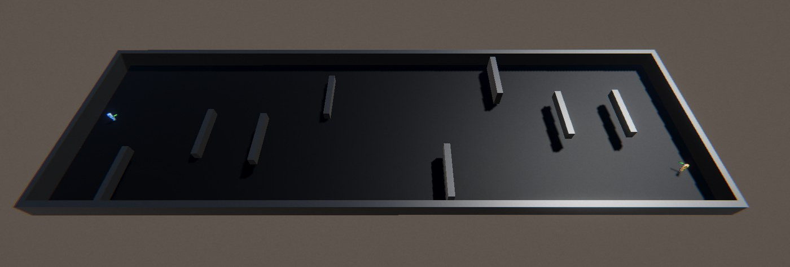
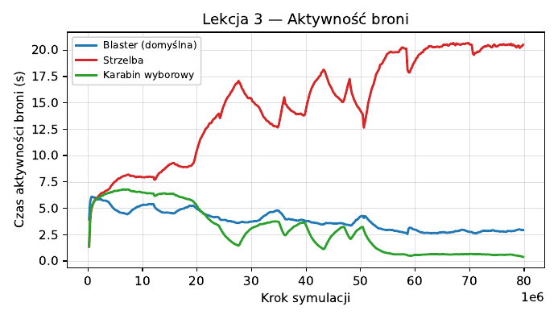
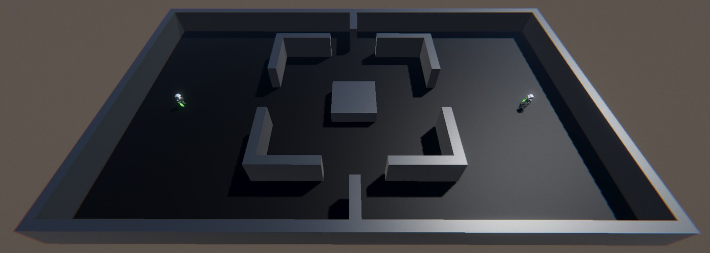

# Machine Learning FPS

A first-person shooter where the bots aren't scripted. They're trained. Built in Unity with ML-Agents, the same characters humans control are also trainable AI agents that learn to move, aim, and shoot through self-play reinforcement learning (PPO).

This is the project behind my master's thesis, *Using machine learning to control opponents in an FPS game* (Kielce University of Technology, Computer Science).



## What's going on here

Every bot runs on the exact same movement and weapon code a human player uses. The only difference is where the input comes from: a human presses keys, an agent reads a trained policy. Change the gameplay code and it affects both sides at once, since there's no separate "AI version" to keep in sync.

Bots learn in stages through a curriculum: early on they're limited to basic movement and aiming, and as training progresses, more actions (jumping, crouching, weapon swapping) and reward signals unlock. Each stage is its own configuration, so you can tune difficulty and behavior without touching a run that's already in progress.

## The game

Two combat robots fight 1v1 on a closed arena. A round ends when one of them runs out of health or the timer runs out (then it's a draw). First to 10 points wins the match.

What a robot can do:

- move forward/back and strafe left/right
- turn left and right (horizontal look only, like old-school Doom; it keeps training simpler)
- jump (with a cooldown) and toggle crouch (70% speed)
- shoot and switch weapons

There's no ammo, only a cooldown per weapon. Shots are hitscan, so a hit lands the moment you fire. There are three laser weapons:

| Weapon | Range | Style |
| --- | --- | --- |
| Blaster (default) | medium | all-rounder |
| Sniper rifle | unlimited | big damage, long cooldown |
| Shotgun | short | many pellets, falls off fast with distance |

A shrinking damage zone pushes both robots toward the middle of the arena so they can't just hide.



## How the bots see the world

I wanted the bots to play more or less like a person would, so they don't get the enemy's position handed to them. Each bot observes:

- its own velocity and view direction
- whether it's on the ground or crouching
- whether its weapon is ready and which weapon is equipped
- its health
- the direction where it last saw the enemy, and how long ago that was

Rewards are shaped by `MLRewardManager` (aiming, closing distance, kills, deaths, penalties for draws and wasted movement). All the numbers live in `MLCurriculumSettings` assets, so each training stage can use its own values.

## Training

Training used PPO with self-play: the bot plays against older snapshots of itself. Many arenas run in parallel in one scene to speed things up.



The curriculum had three lessons. Each one started from the weights of the previous one.

| Lesson | What's new | Arena | Steps |
| --- | --- | --- | --- |
| 1. Move and aim | basic movement and shooting | small, one obstacle | ~120M |
| 2. Jump and crouch | jump and crouch unlocked | bigger, 3 random obstacles | ~112M |
| 3. Pick a weapon | weapon swap unlocked | large, 8 random obstacles | ~75M |

| Lesson 1 | Lesson 2 | Lesson 3 |
| --- | --- | --- |
|  |  |  |

That's about 4 days of compute in total, all on my home PC (Ryzen 7 5800X, 64 GB RAM, GTX 1060 6 GB). So you don't need a server farm to train a working FPS bot.

In lesson 3 the bots settled on the shotgun. Rush the enemy, finish them up close. The sniper rifle was used a lot at first and then almost dropped out.



*Time each weapon was active during lesson 3 (labels in Polish: red = shotgun, green = sniper rifle, blue = blaster).*

### Things that went wrong along the way

- **Reward hacking, round 1.** Early on, a hit was rewarded just for registering. At very high acceleration the hit ray sometimes hit the shooter's own body, and the bot learned to farm reward by shooting itself. Fixed by ignoring self-hits and tying the reward to real health loss.
- **Reward hacking, round 2.** I added a small reward for near misses to help aiming. The bot learned to shoot *next to* the enemy on purpose, because that was safe reward. Removed it.
- **Passive bots.** Sometimes both bots just avoided each other until time ran out. A big draw penalty and the shrinking zone fixed that.
- **Jump spam.** After lesson 2 the bots jump and crouch all the time, obstacle or not. Probably because a bouncing target is harder to hit.
- **Metrics lie a bit.** Reward and ELO often stayed flat while the bots clearly got better. In self-play both sides improve at the same pace, so relative metrics cancel out. I judged progress mostly by watching games and by side metrics like shots fired and weapon usage.

## Results

### Bot vs. bot on a new map

The final model (`cl3.onnx`) played itself on an arena it never saw during training. 5 matches, 146 rounds.



- Once the bots saw each other, fights were quick: about 8 s, ~3 shots, ~46% accuracy.
- But in 21% of rounds neither bot ever saw the other one. Almost half the rounds ended in a draw.

So the fighting part works on new maps. Finding the enemy doesn't.

### Bot vs. humans

Five players, from beginners to experienced, each played one match to 10 points.

| Player | Level | Score (player:bot) |
| --- | --- | --- |
| 1 | beginner | 10:5 |
| 2 | beginner | 10:3 |
| 3 | intermediate | 10:1 |
| 4 | advanced | 10:0 |
| 5 | advanced | 10:0 |

Humans won every match. Two reasons:

1. **Navigation.** People found the bot faster than it found them and often killed it before it fired a shot.
2. **Distance.** The bot loves the shotgun. If you keep your distance and shoot with the blaster or sniper, it has no answer. It never learned to back off or switch weapons.

### Performance

With a standalone build and the Unity profiler, a frame where the agent makes a decision costs about 5.3 ms of CPU (the 60 FPS budget is 16.7 ms). Model inference is ~2.3 ms of that, the whole game (rendering, physics, logic) is ~3 ms.

## What I'd try next

- Give the bot a rough sense of where the enemy is without seeing them, like footstep or gunshot sounds from a direction. That's what human players rely on, and it should help a lot with navigation. It needs retraining from scratch, which is why it didn't make it into the thesis.
- Tune the rewards so that fighting from range pays off too, so the bot doesn't depend only on the shotgun.

## Running it

Open the project in **Unity 6000.4.1f1**. Trained models are in `Assets/Data/Brains/` (`cl3.onnx` is the final one) and are set on the agent's `Behavior Parameters` component.

To train, clone the [ML-Agents toolkit](https://github.com/Unity-Technologies/ml-agents) into `ml-agents/` (the lesson configs in `ml-agents/config/` are already in this repo), build the game to `Builds/`, then run from `ml-agents/`:

```
mlagents-learn config/MLPlayer.yaml --run-id=<run-name>
```

The configs used for the three lessons are `config/cl1.yaml`, `cl2.yaml` and `cl3.yaml`. To continue from an earlier lesson, add `--initialize-from=<previous-run-id>`.

## Project layout

Code lives in `Assets/Scripts/MachineLearningFPS/`:

- `Character/`: movement (`FPSMovement`), input providers, the ML agent (`MLController`) and rewards (`MLRewardManager`)
- `Environment/`: episodes, arenas, spawns, obstacles, game-mode zones, curriculum settings
- `WeaponSystem/`: hitscan weapons with stats stored as ScriptableObjects
- `UI/` and `Camera/`: HUD, menus, spectator camera

## Tech stack

- **Unity 6000.4.1f1** with URP and the new Input System
- **Unity ML-Agents 4.0.2** for training and inference
- Unity Test Framework for Edit Mode and Play Mode tests
